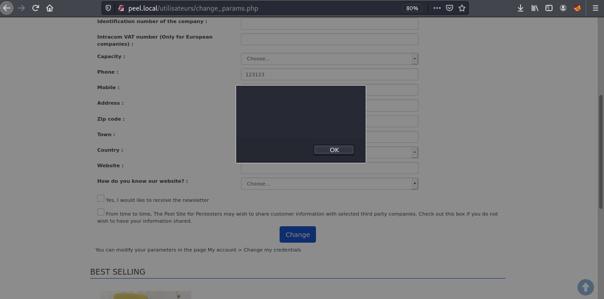

## Peel Shopping cart 9.4.0 Stored XSS


## Date
October 16, 2021

## Exploit Author
Pranav Sivvam

## Vendor Homepage:
https://www.peel.fr/

## Software Link
https://sourceforge.net/projects/peel-shopping/

## Vulnerable Software Link
https://drive.google.com/file/d/1hElJ2eKYfafIucbNWeFB9xZnHUZNV9sK/view?usp=sharing

## Software
Peel Shopping 9.4.0

## Vulnerability

Stored Cross Site Scripting (XSS) in the "Address" field of "http://localhost/peelshopping_9_4_0/utilisateurs/change_params.php"

## Affects

Peel Shopping 9.4.0

### Tested on Linux, Apache httpd

## Description

A Stored Cross Site Scripting attack occurs when a malicious script is injected directly into a vulnerable web application. Every time the infected page is viewed, the malicious script is transmitted to the victim’s browser.

In Peel Shopping 9.4.0, a user supplied polyglot payload in the "Address" field of the "Change my credentials" form (change_params.php) is echoed back in javascript code in HTML response. This allows an attacker to input malicious JavaScript which can steal cookie, redirect them to other malicious website, etc.

## Proof of Concept

1. Log in to your account

2. Navigate to the "Change my credentials" page (http://localhost/peel_9_4_0/utilisateurs/change_params.php)

3. Paste the payload in the "Address" field

```jaVasCript:/*-/*`/*\`/*'/*"/**/(/* */oNcliCk=alert() )//%0D%0A%0d%0a//</stYle/</titLe/</teXtarEa/</scRipt/--!>\x3csVg/<sVg/oNloAd=alert()//>\x3e```

4. Click on "Change"

5. You will now get an alert box indicating that the malicious script has executed.
